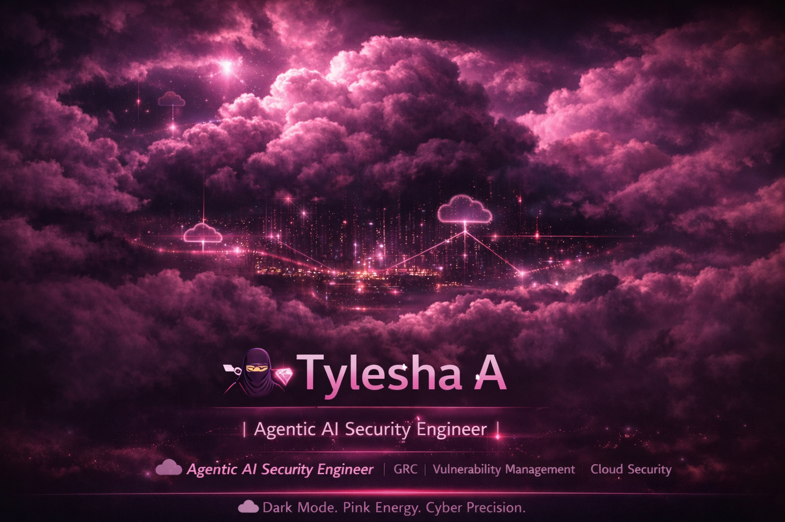

  

<h1 align="center">🥷💎 Tylesha A</h1>

  

<h3 align="center">☁️ Dark Mode. Pink Energy. Cyber Precision.</h3>

---

## 🌸 About Me

Security-minded. Cloud-focused. AI-aware.

I design and document real-world cybersecurity simulations involving:

- NIST 800-53 Control Mapping  
- AI Risk & Shadow AI Audits  
- Vulnerability Lifecycle Management  
- Identity & Access Governance  
- Cloud Risk Assessments  

Consistency builds mastery. Mastery builds leverage.

---

## 💎 Cybersecurity Arsenal

  
  
  
  
  
  
  

---

## 📊 Performance Metrics

  
  

---

## 🎯 Current Focus

- ☁️ Cloud Security Engineering Role  
- 🔐 Security+ Certification  
- 🤖 AI Risk Detection Projects  
- 📊 Advanced Vulnerability Reporting  
- 🛡️ Microsoft Sentinel Log Analysis  

---

  🌸 Built in the Cloud. Secured in Pink. 🥷💎

