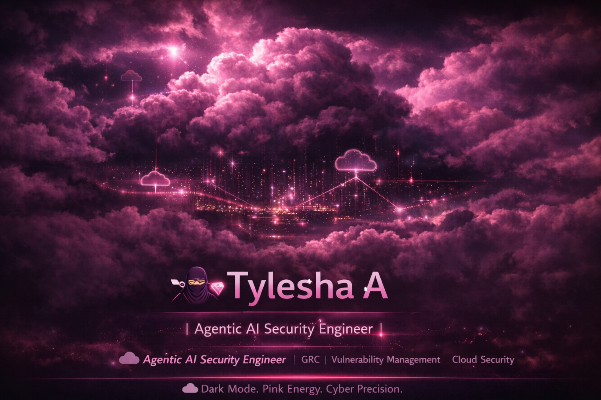

  

<h1 align="center">🥷💎 Tylesha Alexander</h1>

  

<h3 align="center">☁️ Dark Mode. Pink Energy. Cyber Precision.</h3>

---

# 🌸 About Me

Security-minded. Cloud-focused. AI-aware.

I build and document **real-world cybersecurity labs and remediation projects** focused on improving enterprise security posture.

My work centers around:

- 🔐 **Windows STIG Remediation & Compliance Automation**
- ☁️ **Azure Security & Microsoft Sentinel Monitoring**
- 🛡 **Vulnerability Lifecycle Management (Tenable)**
- 🧠 **AI Risk & Shadow AI Governance**
- 📊 **NIST 800-53 Security Control Mapping**
- 🔑 **Identity & Access Governance**

I believe consistency builds mastery — and mastery builds leverage.

---

# 💎 Cybersecurity Arsenal

  
  
  
  
  
  
  
  

---

# 🛠 Cybersecurity Projects

### 🤖 AI Risk & Governance
- AI risk detection simulations
- Shadow AI audit concepts
- NIST control mapping for emerging AI risks
- Phantom Strike AI
- Angentic AI Red_Team_Scaner

https://github.com/Tyleshancloud7/-Agentic-AI-SaaS-Report-PhantomStrike-AI-Autonomous-Red-Team-Simulation-Platform/blob/main/README.md

https://github.com/Tyleshancloud7/Red_Team_Scanner

https://github.com/Tyleshancloud7/Ghost-Employee-Risk-Audit-AC2

https://github.com/Tyleshancloud7/ai-phishing-detector

https://github.com/Tyleshancloud7/Shadow-AI-Risk-Audit-Ninja-Edition

### 🔐 STIG Remediation Automation
- **Windows 11 STIG Remediation Scripts (PowerShell)**
- Automated fixes for DISA STIG findings including:
  - Event Log Configuration
  - WinRM Authentication Hardening
  - VBS Security Enforcement
  - Group Policy Security Controls
    
 https://github.com/Tyleshancloud7/Nessus-agent-lab
 https://github.com/Tyleshancloud7/STIG-WN11-AU-000500-.ps1

### ☁️ Cloud Security Labs
- **Azure Sentinel Security Monitoring**
- Threat visualization using KQL and world map analytics
- Authentication failure analysis
  
https://github.com/Tyleshancloud7/azure-sentinel-global-threat-visualizations

### 🛡 Vulnerability Management
- **Tenable Vulnerability Scanning**
- STIG compliance validation
- Remediation verification using PowerShell automation
  
https://github.com/Tyleshancloud7/Vulnerability-Management-Program
https://github.com/Tyleshancloud7/Tyleshancloud7s
  

---

# 📊 GitHub Stats

---

# 🎯 Current Focus

- ☁️ Transitioning into a **Cloud Security / Security Analyst role**
- 🔐 Preparing for **CompTIA Security+**
- 🧠 Building **AI Risk Detection Projects**
- 📊 Expanding **Vulnerability Management Labs**
- 🛡 Advanced **Microsoft Sentinel Threat Analysis**

---

# 🌐 Connect With Me

---

🌸 Built in the Cloud. Secured in Pink. 🥷💎

